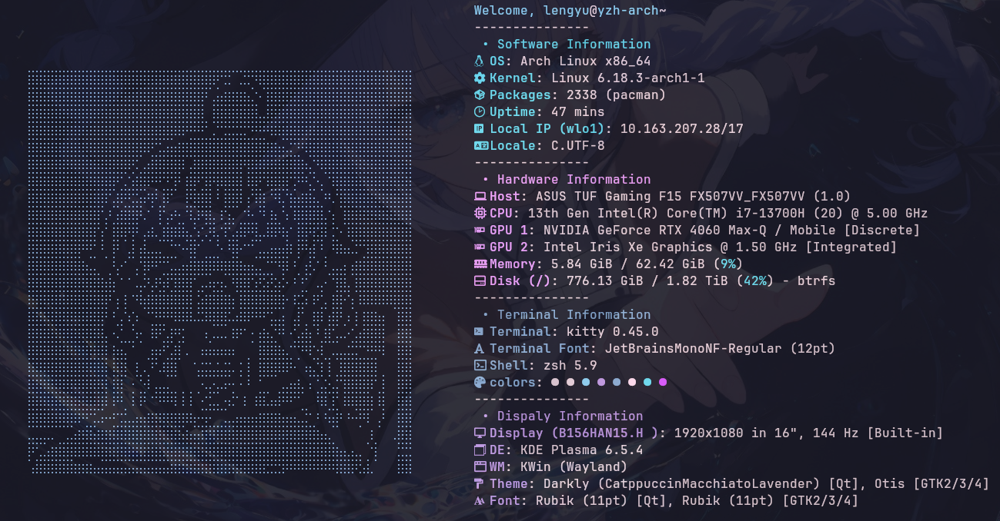
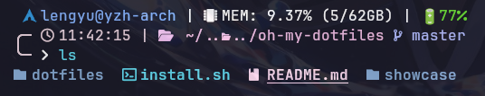

# oh-my-dotfiles
用来存放自己各种配置文件的仓库

---

## 食用指南
将仓库 clone 下来之后，在项目文件夹下使用 `install.sh` 安装即可：

```bash
./install.sh
```

> ⚠️ 安装前请务必对自己原本的配置文件备份！

## 配置效果
- **fastfetch & kitty**



> 这里点图的生成使用了该网站提供的工具：https://emojicombos.com/dot-art-generator
>
> （后续小生可能会尝试自己复现一个这样的工具来试试）

- oh-my-posh & zsh

